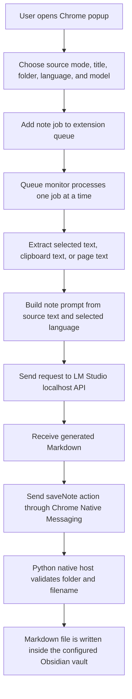
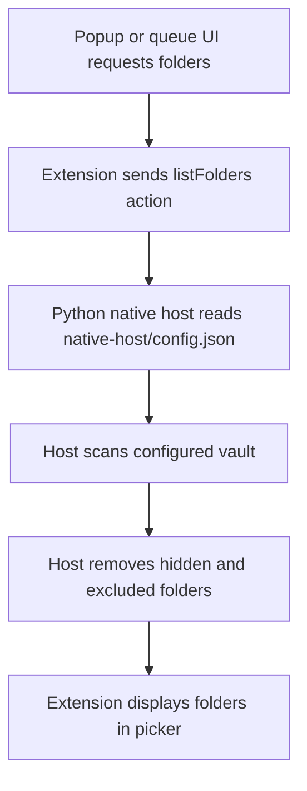
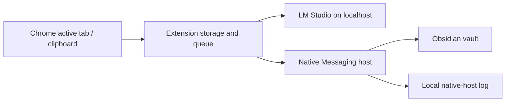

# Workflow Diagram

## Capture And Save Flow

## Folder Loading Flow

## Local Data Boundaries

## Public Safety Notes

- Tracked files should contain only placeholders for vault paths and Chrome extension IDs.
- Real local config belongs in ignored files under `native-host/`.
- The default model endpoint is localhost; remote endpoints change the privacy boundary and should be documented in local setup notes.
